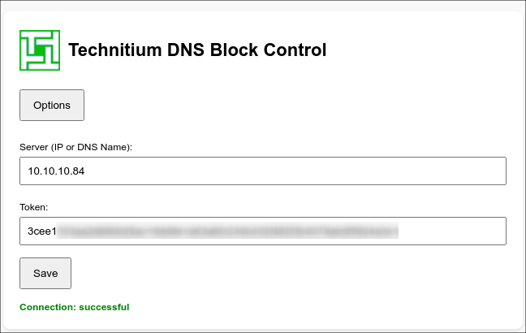
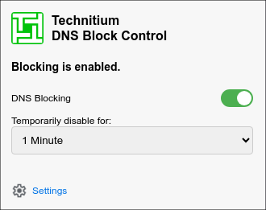
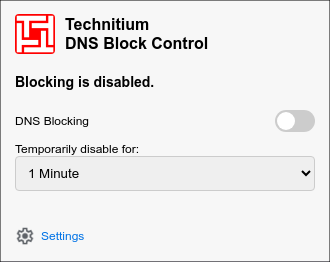

<p align="center"> 
  
</p>

# <p align="center"> **Technitium DNS Block Control Extension** </p>

This browser extension was created as a **proof of concept** with the help of **AI** to explore the feasibility of managing DNS blocking on a **Technitium DNS Server** via its HTTP API.

> [!WARNING]
> 🚨 **Disclaimer:** This project is experimental and provided “as is” without any guarantees.  
> **Use at your own risk.** The author assumes no responsibility for any issues arising from its usage.

---

## Overview

The extension allows you to:

- Toggle **DNS blocking on/off** on your Technitium DNS Server.
- **Temporarily disable** blocking for a defined amount of time.
- See the **current blocking status** and icon color directly in the browser toolbar.
- Configure the **server URL** and **API token** via an options page.
- Run a **connection test** and a **manual update check** for the Technitium DNS Server.
- View basic **POC information** such as current Technitium version and server uptime.

All configuration data (server URL, token, temporary disable info) is stored **locally in the browser** using `chrome.storage.local`. No data is sent anywhere else.


<p align="center">
  
</p>

<br/>

<p align="center">
  
  
</p>


---

## Features

### Popup

- **Live blocking status**
  - Text: “Blocking is enabled/disabled.”
  - Toolbar icon and popup logo switch between **green** (blocking enabled) and **red** (blocking disabled).
- **DNS Blocking switch**
  - Permanently enable/disable blocking via  
    `GET /api/settings/set?enableBlocking=<true|false>&token=...`
- **Temporary disable**
  - Disable blocking for a configurable duration (e.g. 1, 5, 15, 30, 60 minutes or 24 hours) via  
    `GET /api/settings/temporaryDisableBlocking?minutes=...&token=...`
  - The server’s response field `temporaryDisableBlockingTill` is used to start a **local countdown**.
- **Countdown**
  - Shows `Blocking resumes in HH:MM:SS` while a temporary disable is active.
  - If blocking is manually re-enabled, the countdown stops immediately and the stored expiry timestamp is cleared.
- **Settings shortcut**
  - Opens the extension options page.
- **Manual update check**
  - Button: **Check update**
  - Uses `GET /api/user/checkForUpdate?token=...`.
  - Shows the **current server version** and, if applicable, the new available version  
    (e.g. `Version 14.0.1 → 14.1.0 available` or `Version 14.0.1 (up to date)`).

### Options Page

- **Server & token configuration**
  - Server input is normalized:
    - If no scheme is provided, `http://` is prepended.
    - If no port is provided, `:5380` is added.
  - Only the origin (scheme + host + port) is stored.
- **Connection test**
  - Uses `GET /api/settings/get?token=...`.
  - Shows `Connection: successful` or detailed error information.
- **Update check**
  - Button: **Update Check** (next to **Save**, with spacing).
  - Uses `GET /api/user/checkForUpdate?token=...`.
  - Updates the POC info (see below) to indicate whether the installed version is up to date or not.
- **POC information block**
  - `[POC] Technitium DNS Block Control Extension by HannesMC`
  - **Technitium Version:**  
    - Reads the current version (primarily from `settings/get`, optionally from the update check).
    - Shows **green** text when up to date, **red** when an update is available.
  - **Server up since:**  
    - Uses `uptimestamp` from `settings/get` (if available).
    - Displays local date/time and the duration the server has been running (e.g. `for 3h 12m`).

---

## Requirements

- A running **Technitium DNS Server** with HTTP API enabled.
- A valid **API token** (session token) that can be used with:
  - `/api/settings/get`
  - `/api/settings/set`
  - `/api/settings/temporaryDisableBlocking`
  - `/api/user/checkForUpdate`
- Chrome / Chromium-based browser with support for **Manifest V3** extensions.

---

## Installation

### Load the extension in Chrome (Developer Mode)

1. Clone this repository:
    ```bash
   git clone https://github.com/HannesMC/technitium-dns-browser-extension.git
    ```
2. Open Google Chrome and go to chrome://extensions/
3. Enable Developer mode (toggle in the top right corner).
4. Click Load unpacked and select the cloned repository folder.
5. The extension icon should now appear in your browser toolbar.

## Usage

1. Open the extension popup by clicking on the icon.
2. If not configured yet, click Settings, then:
- Enter your Technitium server (IP or DNS name, optionally with port).
- Enter your API token.
- Click Save and verify that the Connection status shows Connection: successful.
3. Back in the popup:
- Use the DNS Blocking switch to permanently enable/disable blocking.
- Use the Temporarily disable for dropdown to schedule a temporary unblock.
- Watch the countdown while temporary blocking is active.
4. For server updates:
- In the popup: click Check update to see if a new Technitium version is available.
- In the options: click Update Check to update the POC info (version color and status).

## Security & Privacy

- All configuration values (server URL, token, temporary disable timestamp) are stored locally in the browser using chrome.storage.local.
- The extension communicates only with the configured Technitium DNS Server and does not send data to any third party.
- Nevertheless, treat your API token as a secret and restrict its permissions on the server side where possible.

## Changelog (short)

- 2025-11-14
    - Added manual update check in popup and options (/api/user/checkForUpdate).
    - Added countdown for temporary blocking with automatic stop when blocking is re-enabled.
    - Added connection test via /api/settings/get.
    - Added info block with Technitium version and server uptime.

- Initial version
    - Basic popup with permanent toggle and temporary disable for DNS blocking.
    - Simple settings page for server URL and token.
    - Toolbar icon reflects blocking status (green/red).

## License

This project is licensed under the [**GPL-3.0 License**](https://github.com/HannesMC/technitium-dns-browser-extension/blob/main/LICENSE).
See the LICENSE file for full details.

## Credits

- **Technitium Icons** – Used under GPL-3.0 License.
  - See [Technitium DNS Server](https://github.com/TechnitiumSoftware/DnsServer) for details.
- **Gear Icon from Google Material Icons** - Licensed unter [Apache License 2.0](https://www.apache.org/licenses/LICENSE-2.0).
  - See [Google Material Icons](https://fonts.google.com/icons) for more details.


